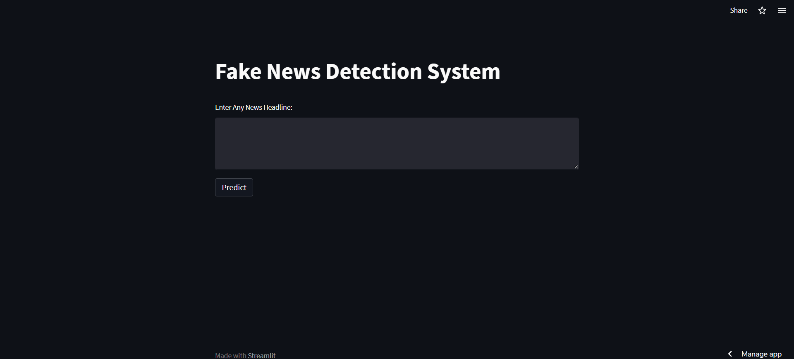
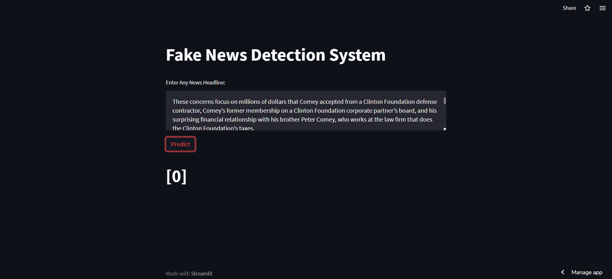
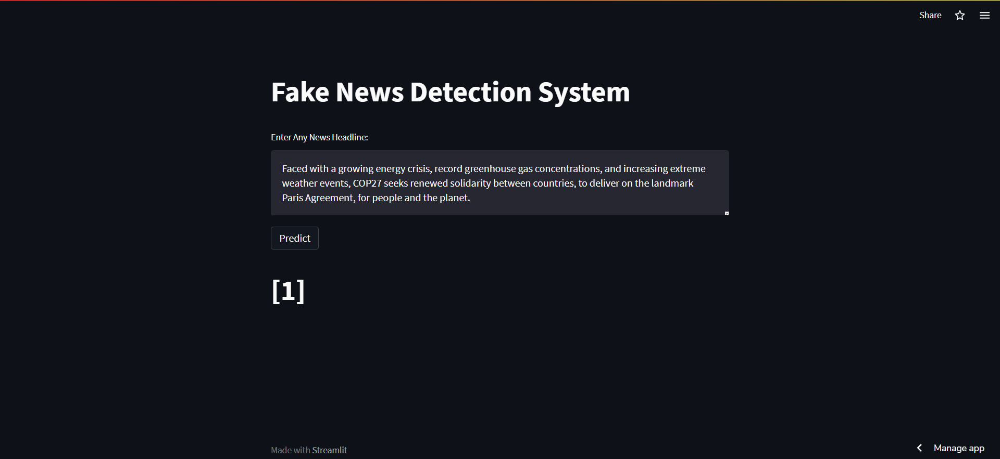

# Fake News Detection System using Streamlit

Fake News Detection in Python:

To classify fake news articles using sci-kit and nltk libraries from Python, we have used natural language processing techniques and machine learning algorithms.

Check out the live demo: https://aditya-aryan123-streamlit-recommendationsystem-app-app-w4qqhu.streamlit.app/

## Screenshot of the Project

0 - Fake News
1 - Real News

## Overview

The goal of this project is to classify fake news from real news and create a machine learning based algorithm for automatic labelling of texts that are potentially deceptive. Data was extracted from University of Victoria https://www.uvic.ca/ecs/ece/isot/datasets/fake-news/index.php. Data was preprocessed and cleaned using regex and nltk library for future modelling purpose. Multinomial Naive Bayes model is used for the classification purpose and TF-IDF Vectorizer was used to convert text data to numeric. Deployment was done on Streamlit Cloud.

## File Structure

model.py: It includes cleaning, preprocessing and modelling steps.
app.py: This is the deployment file.

## How to run the project?

1. Clone or download this repository to your local machine.
2. Install all the libraries mentioned in the requirements.txt file with the command pip install -r requirements.txt
3. Open your terminal/command prompt from your project directory and run the file app.py by executing the command streamlit run app.py and it'll automatically open in your browser.
